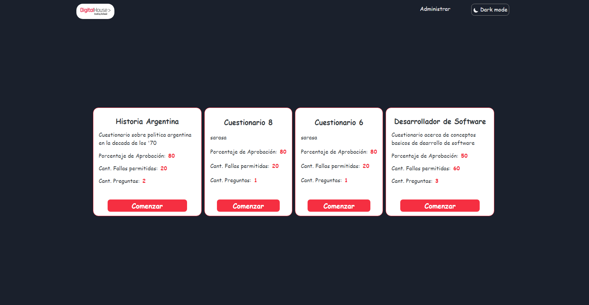

## Digital House Challenge - Cuestionarios

#### ¿De que trata el desafío?
Se debe desarrollar una pequeña aplicación donde se configuren cuestionarios, además, se debe previsualizar el cuestionario cómo si lo viera un usuario que lo responde. Las reglas de negocio son las siguientes: 
* Un cuestionario, tiene un título, un enunciado, un porcentaje de aprobación y una cantidad de intentos límite (todos son campos obligatorios). 
* El cuestionario debe tener al menos una pregunta y las preguntas pueden ser de tipo Multiple Choice, Single Choice. 
* Las preguntas de multiple choice tienen un enunciado, y las opciones que deben poder ser marcadas cómo correctas. 
* Las preguntas de single choice son iguales, pero sólo se puede marcar una sola opción como correcta. 
* Las preguntas deben tener un orden y se deben poder ordenar desde la UI. ● El cuestionario tiene que persistirse haciendo un llamado al backend. Para simular la api utilizar esta libreria https://github.com/typicode/json-server 
* El usuario final debe poder responder el cuestionario, esto debe contar en el estado de la aplicación la cantidad de intentos que realizó y si aprobó.

#### Objetivos 
1. Levantar el proyecto con CRA y configurar todo para trabajar, poner foco en realizar un proyecto escalable y mantenible, usando react con hooks, redux, sass, BEM como nomenclatura, y cubrir completamente algunos de los componentes con test de snapshot para cubrir el desarrollo. 
2. La aplicación debe poder deployarse en modo productivo a través de una imagen de docker construida a base de nginx. La aplicación debe publicarse en git. 
3. Estructurar correctamente los datos cargados en el formulario y las relaciones entre todas las entidades planteadas. 
4. Buscar la mejor solución al problema y justificar las decisiones de arquitectura tomadas.

### Comandos disponibles 
| Comando  | Descripción  | 
| :------------ |:---------------:|
| npm start      | Levanta la aplicacion React localmente |
| npm run start-server      | Levanta el json-server localmente en el puerto 4001 |
| npm run test      | Corre los test con jest y react-testing-library           |
| npm run build | Genera un build de la aplicación para poder publicarla        |

### Proyecto deployado en netlify:
Podemos ver una demo: [aquí](https://digital-house-challenge-juan.netlify.com/)

### Construir y montar imagen docker:
1. Correr en consola: "docker build -t nombreImagen ."
2. Una vez creada la imagen, arrancamos el contenedor: "docker run -it -p 8000:80 --name nombreContenedor nombreImagen".
3. Ingresar a https://localhost:8000/  (o el puerto que hayamos escogido previamente)

### Paginas
| Ruta  | Descripción  | 
| :------------ |:---------------:|
| /      | Home |
| /config/      | Página con tabla para configurar cuestionarios     |
| /config/:id      | Página para editar/visualizar/crear un cuestionario en particular     |
| /form/:id | Pagina donde se responde el cuestionario        |
| /history | Pagina para ver el historial de cuestionarios respondidos        |
| /history/:id | Pagina para ver en detalle el cuestionario realizado, preguntas contestadas bien y mal, puntuación, etc. (TO DO)        |
| * | Página no encontrada        |

### Librerías/Tecnologias utilizadas
`create-react-app`: Por definición del desafío se avanzo con CRA como boilerplate.  
`Typescript`: El proyecto fue realizado con tipos e interfaces de typescript.  
`json-server`: A falta de un servidor y por definición del desafío se utilizo esta opción para simular un servidor facilmente.  
`SASS`: Por definición del desafío se avanzo con estilos en SASS , con la nomenclatura BEM.
`Redux Thunk`: Por definición del desafío se utilizó redux thunk para manejo asincronico del estado global.  
`Netlify`: Para deployar la aplicación.  
`Material-ui`: Para armar rapidamente la tabla de gestión de cuestionarios. 
`React Router DOM`: Para gestionar el enrutado de la aplicación. 
`Chakra-UI`: Se utilizó solo para la funcionalidad dark/light mode. 

### Testing Unitario
#### Jest y @testing-library 
La gran mayoria de los componentes fueron testeados con snapshots y testing library y algunos hooks con testing library hooks

### Cosas por agregar/mejorar
* Diseño responsive
* Finalizar pantalla de consulta de cuestionario consultado.
* Volcar absolutamente todo los estilos con SASS para eliminar chakra(para la funcionalidad del mode).
* Mejoras de diseño.
* Testear todos los componentes, paginas y hooks y realizar test de integración.